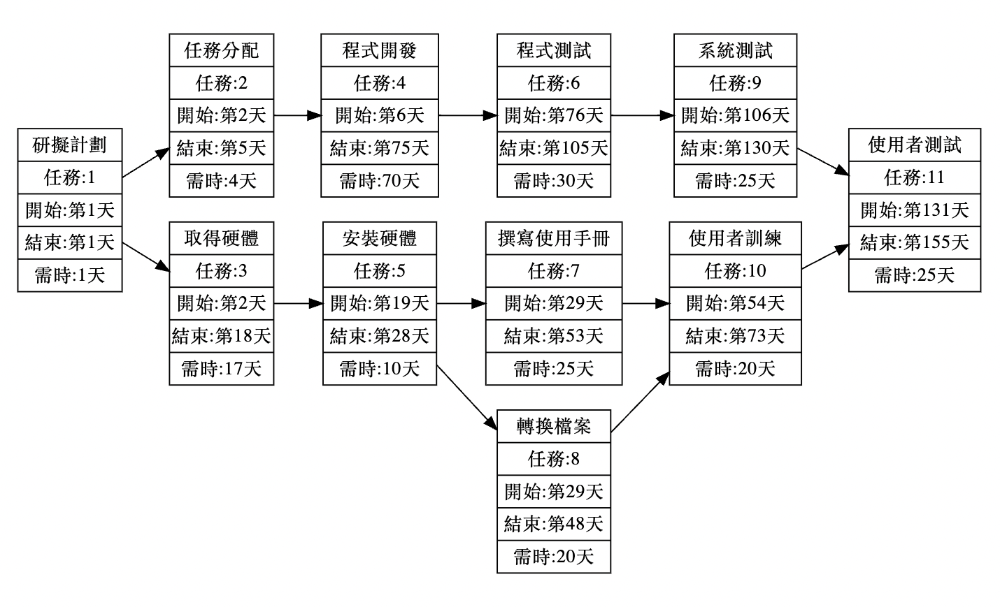
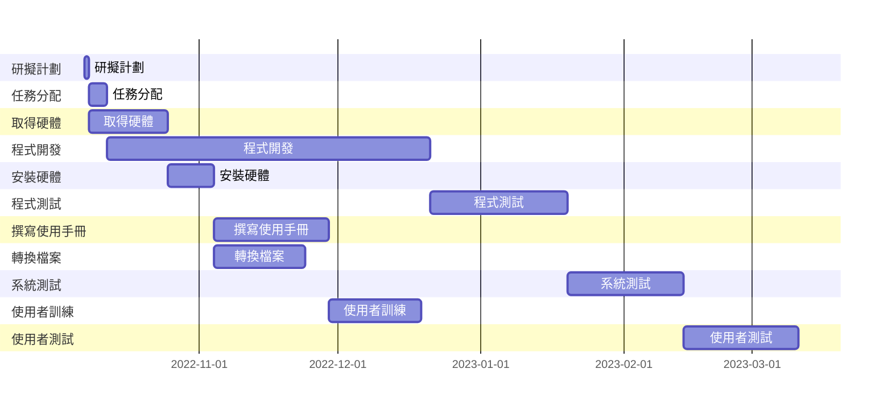

# hw2

(1)

(2)

```mermaid
gantt
    section 研擬計劃
    研擬計劃: 1, 2022-10-07, 1d
    section 任務分配
    任務分配: 2, after 1, 4d
    section 取得硬體
    取得硬體: 3, after 1, 17d
    section 程式開發
    程式開發: 4, after 2, 70d
    section 安裝硬體
    安裝硬體: 5, after 3, 10d
    section 程式測試
    程式測試: 6, after 4, 30d
    section 撰寫使用手冊
    撰寫使用手冊: 7, after 5, 25d
    section 轉換檔案
    轉換檔案: 8, after 5, 20d
    section 系統測試
    系統測試: 9, after 6, 25d
    section 使用者訓練
    使用者訓練: 10, after 7, 20d
    section 使用者測試
    使用者測試: 11, after 9, 25d
```

(3)
關鍵路徑： 1 → 2 → 4 → 6 → 9 → 11
